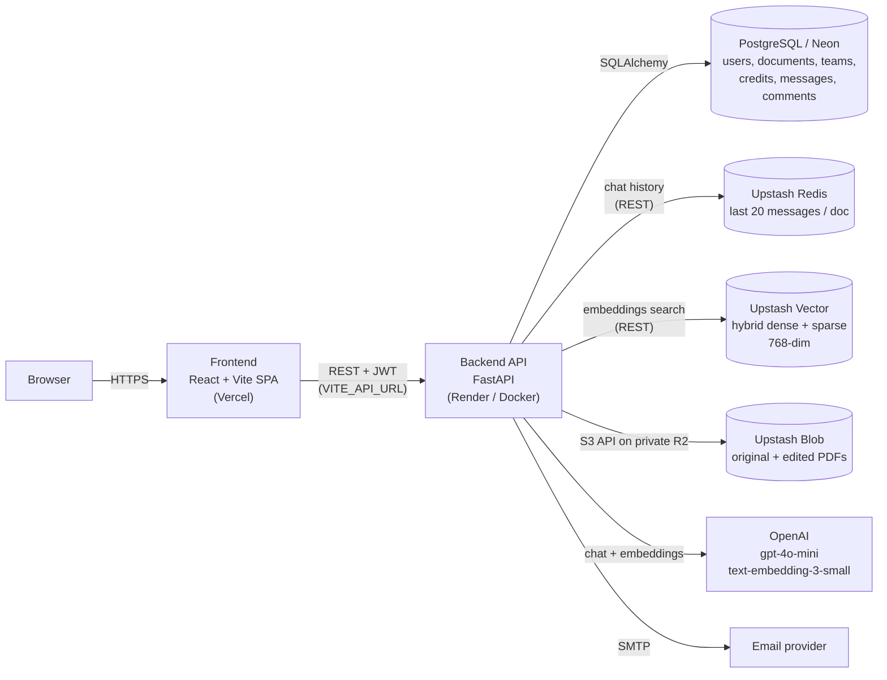
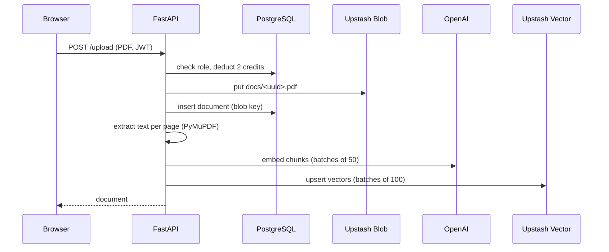
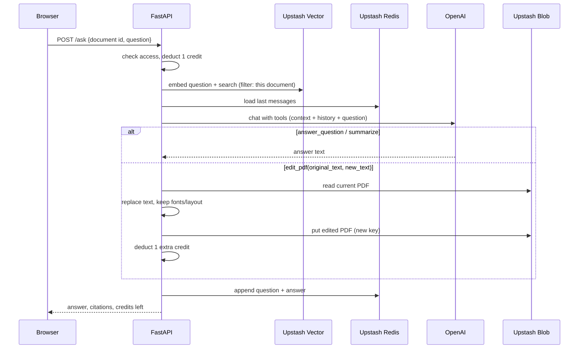

# DocuQuery 📚

DocuQuery lets you upload PDFs, **ask questions about them in plain language**, and even **edit their text by chatting** — with the original fonts, sizes and colours preserved. Answers are grounded in your document and cite page numbers.

**Live:** frontend on Vercel · API on Render

## ✨ Features

- 📄 Upload PDFs (private storage, per-user or shared with a team)
- 🔍 Ask questions and get answers with page citations (RAG over the document)
- 🧠 Multi-turn chat with per-document memory
- ✏️ Edit PDF text via chat ("change SAURABH SHUKLA to RISHABH SHUKLA"), keeping font, size, colour and layout
- 📝 Summaries, chat export, and document comments
- 👥 Team workspaces: roles (owner / admin / editor / viewer), shared documents, shared prompts, invites
- 💳 Credit-based usage with Free / Starter / Pro / Team plans
- 🔐 Signup, login (JWT) and password reset by email

---

## 🏗 Architecture



Each external service has one job:

| Service | Role | Stored data | Key details |
|---|---|---|---|
| **PostgreSQL** (Neon in prod, SQLite locally) | System of record | Users, documents (metadata + blob keys), messages, credit ledger, teams, members, invites, prompts, comments | SQLAlchemy models in `backend/app/models.py`; missing columns are added on startup |
| **Upstash Blob** | File storage | The uploaded PDF and every edited version | Private bucket (Cloudflare R2). Objects live under `docs/…`; the DB stores only the key. |
| **Upstash Vector** | Semantic search (RAG) | One vector per ~400-word chunk, with its text, page number and document id in metadata | 768 dimensions; **hybrid** (dense + sparse) index recommended |
| **Upstash Redis** | Conversation memory | `chat:{document_id}` list, last 20 messages, 24 h TTL | Gives the model follow-up context |
| **OpenAI** | Language + embeddings | Nothing stored by us | `gpt-4o-mini` with forced function calling; `text-embedding-3-small` shortened to 768 dims |

### Blob storage (Upstash Blob)

- PDFs are **private**. The API never hands out storage URLs; the browser calls `GET /documents/{id}/file` (with its JWT) and the API checks access, then streams the bytes.
- Auth to storage: the `UPSTASH_BLOB_TOKEN` is exchanged at `https://blob.upstash.io/v1/credentials` for short-lived S3 credentials (~10 min). They are cached and refreshed automatically, then used with `boto3` against R2's S3-compatible endpoint (`backend/app/services/blob_service.py`).
- Keys are random (`docs/<uuid>.pdf`, edits are `docs/edited_<uuid>.pdf`), so filenames never collide. The original upload is never modified; each new edit is saved as a new object and replaces the previous edited copy.
- The server holds no state on disk, so the backend can be stateless (containers, serverless, autoscaling).

### Vector search (Upstash Vector)

- On upload, the text is split **per page** into ~400-word chunks (50-word overlap). Each chunk gets a dense embedding (OpenAI) and, if the index is hybrid, a sparse term-frequency vector (hashed terms).
- Vector ids are `doc_{document_id}_chunk_{n}`. Metadata holds `document_id`, `chunk_index`, `page_number` and `text`.
- A query is embedded the same way and searched with the filter `document_id = <id>`, so a question only ever sees its own document. The top 5 chunks are returned as `[Page N] …` blocks, which is how answers get page citations.
- Create the index as **Hybrid, 768 dimensions**. A dense-only index also works; sparse vectors are skipped automatically.
- Deleting a document deletes its vectors.

### Chat memory (Upstash Redis)

- Each document has its own list, `chat:{document_id}`, trimmed to the last 20 messages and expiring after 24 hours of inactivity. The messages are also saved permanently in PostgreSQL for the chat history/export.

### OpenAI

- **Chat:** `gpt-4o-mini` (override with `OPENAI_CHAT_MODEL`) is called with three tools — `answer_question`, `summarize`, `edit_pdf` — and `tool_choice="required"`, so every request resolves to exactly one action.
- **Embeddings:** `text-embedding-3-small` with `dimensions=768` (override with `OPENAI_EMBEDDING_MODEL`).
- Rate-limit, quota and 5xx errors are turned into friendly messages instead of failing the request.

---

## 🔄 Request flows

### Upload



### Ask a question



### View, edit and delete

- **View / download:** `GET /documents/{id}/file?edited=true` streams the PDF from Blob after an access check.
- **Edit:** always starts from the latest version (`edited_file_path`), so edits stack. The superseded edited copy is deleted; the original is kept.
- **Delete:** removes comments and the DB row, clears the Redis history, deletes both blobs and the vectors.

---

## ✏️ How PDF editing keeps the formatting

The engine lives in `backend/app/services/pdf_editor.py` (PyMuPDF only, unit-tested with generated PDFs):

- **Finds text at character level**, across spans, styles and wrapped lines; tolerant of case, ligatures, non-breaking spaces and curly quotes. Whole-word matches are preferred.
- **Removes the old glyphs** (redaction) instead of covering them with a white box, so backgrounds are untouched and the old text is gone from the text layer.
- **Draws the new text in a font that can render it:** the PDF's own embedded font when it has the letters, otherwise a matching Helvetica/Times/Courier (same family, bold, italic), then a bundled DejaVu font. Size, colour, opacity, baseline and rotation come from the original text.
- **Absorbs width changes:** following text on the line is shifted (ligature-aware), right-aligned text keeps its right edge, and the new text is squeezed at most 15% — never pushed off the page.
- **Tells you what happened:** substitutions and tight fits are returned as warnings and shown in the chat reply.

Known limits: no paragraph reflow (a much longer replacement on a full line will overlap and warn), scanned/image-only pages only get their text layer changed, and complex scripts (CJK, Indic, Arabic) are not properly supported.

---

## 💳 Credits, plans and teams

| Action | Credits |
|---|---|
| Upload a PDF | 2 |
| Ask a question | 1 |
| Edit a PDF | +1 on top of the question (2 total) |

New accounts get 20 free credits. Plans: **Free**, **Starter** ($9 · 500/mo), **Pro** ($29 · 2,000/mo), **Team** ($79 · 5 seats, 1,500 credits/seat). Every change is recorded in a credit ledger.

Teams have one workspace per user with roles `owner`, `admin`, `editor`, `viewer`. Viewers can read documents but cannot upload or edit. Documents can be shared with the team, and teams keep shared prompt templates.

---

## 🛠 Tech stack

**Backend** — Python 3.12, FastAPI, SQLAlchemy, PyMuPDF, OpenAI SDK, `upstash-redis`, `upstash-vector`, boto3 (for Blob), bcrypt + PyJWT

**Frontend** — React 18 + TypeScript, Vite, React Router, Tailwind CSS, shadcn/ui (Radix), Axios, react-pdf

**Infra** — Vercel (frontend), Render or any container host (backend, Docker), Neon (PostgreSQL), Upstash (Blob, Vector, Redis), OpenAI

---

## 🚀 Getting started

### Prerequisites

- Python 3.12+, Node.js 18+ (Docker image uses 20)
- An OpenAI API key
- A PostgreSQL database (or use SQLite locally)
- From [Upstash](https://upstash.com): a **Blob** bucket, a **Redis** database, and a **Vector** index (hybrid, 768 dimensions)
- Docker (optional)

### 1. Backend

```bash
cd backend
python -m venv venv
source venv/bin/activate          # Windows: venv\Scripts\activate
pip install -r requirements.txt
cp .env.example .env              # then fill in the values below
uvicorn app.main:app --reload     # http://localhost:8000  (docs at /docs)
```

### 2. Frontend

```bash
cd frontend
npm install
npm run dev                       # http://localhost:3000
```

The frontend calls `http://127.0.0.1:8000` by default. To point it elsewhere, set `VITE_API_URL` (for example in `frontend/.env`).

### 3. Environment variables (`backend/.env`)

| Variable | Required | Description |
|---|---|---|
| `DATABASE_URL` | ✅ | e.g. `sqlite:///./test.db` locally, `postgresql://…` in production |
| `SECRET_KEY` | ✅ in prod | Signs login tokens. Use a long random value (`openssl rand -hex 32`); the built-in default is public |
| `OPENAI_API_KEY` | ✅ | OpenAI key |
| `UPSTASH_BLOB_TOKEN` | ✅ | Blob bucket token |
| `UPSTASH_REDIS_REST_URL`, `UPSTASH_REDIS_REST_TOKEN` | ✅ | Redis REST credentials |
| `UPSTASH_VECTOR_REST_URL`, `UPSTASH_VECTOR_REST_TOKEN` | ✅ | Vector index REST credentials |
| `ENVIRONMENT` | | `development` or `production` |
| `FRONTEND_URL` | | Public frontend URL; used in password-reset links and allowed by CORS |
| `CORS_ORIGINS` | | Extra allowed origins, comma-separated |
| `CORS_ORIGIN_REGEX` | | Regex of allowed origins (defaults to this project's Vercel domains) |
| `SMTP_HOST`, `SMTP_PORT`, `SMTP_USER`, `SMTP_PASSWORD`, `SMTP_FROM` | | Email for password reset. Without `SMTP_HOST` the reset link is printed to the log in development |
| `OPENAI_CHAT_MODEL`, `OPENAI_EMBEDDING_MODEL` | | Override the default models |

Frontend: `VITE_API_URL` — backend base URL, baked in at build time.

---

## 🐳 Docker

```bash
make up          # docker compose up --build  (backend :8000, frontend :3000, hot reload)
make test        # run the backend tests in a container
make down
```

Backend image only:

```bash
docker build -t docuquery-backend ./backend
docker run -p 8000:8000 --env-file backend/.env docuquery-backend
```

The image runs as a non-root user, listens on `$PORT` (default 8000), and exposes `GET /health` for health checks. `--reload` is only used by docker compose for local development.

---

## ☁️ Deployment

1. **Backend (Render or any Docker host):** deploy `backend/` using its Dockerfile, set the environment variables above (with `ENVIRONMENT=production`), and use `/health` as the health check. The service keeps no local state, so it can restart or scale freely. Free tiers sleep when idle, so the first request can be slow.
2. **Frontend (Vercel):** import the repo, set **Root Directory** to `frontend`, and add `VITE_API_URL=https://<your-backend>` (no trailing slash). `frontend/vercel.json` rewrites all routes to `index.html` so React Router deep links work. Redeploy after changing the variable.
3. **Connect them:** set `FRONTEND_URL` on the backend to your Vercel URL. CORS allows localhost, `FRONTEND_URL`, `CORS_ORIGINS`, and Vercel domains matching `CORS_ORIGIN_REGEX`.

---

## 📚 API overview

Interactive docs are served at `/docs`. All routes except auth and `/health` need `Authorization: Bearer <token>`.

| Area | Endpoints |
|---|---|
| Auth | `POST /signup`, `POST /login`, `POST /forgot-password`, `POST /reset-password`, `GET /me` |
| Documents | `POST /upload`, `GET /documents`, `GET /documents/{id}/file`, `DELETE /documents/{id}` |
| Chat | `POST /ask`, `GET/POST /documents/{id}/messages`, `GET /documents/{id}/export` |
| Comments | `GET/POST /documents/{id}/comments`, `PATCH /comments/{id}/resolve` |
| Credits & plans | `GET /plans`, `POST /upgrade-plan`, `GET /credits/history` |
| Teams | `GET /teams/me`, `POST /teams`, `POST /teams/{id}/invite`, `POST /teams/invites/{id}/accept`, `DELETE /teams/invites/{id}`, `PATCH/DELETE /teams/{id}/members/{user_id}`, `GET /teams/{id}/usage`, `GET/POST /teams/{id}/prompts`, `DELETE /teams/{id}/prompts/{prompt_id}` |
| Ops | `GET /health` |

---

## 🗂 Project structure

```
backend/
  app/
    main.py                 # app, CORS, /health, startup migrations
    models.py, schemas.py   # SQLAlchemy models, Pydantic schemas
    api/routes.py           # auth, documents, chat, credits
    api/teams.py            # teams, prompts, comments
    services/
      pdf_service.py        # OpenAI tool calling, RAG orchestration
      pdf_editor.py         # font-preserving text replacement engine
      vector_service.py     # chunking, embeddings, Upstash Vector
      redis_service.py      # chat memory, Upstash Redis
      blob_service.py       # PDF storage, Upstash Blob
      credit_service.py     # plans, pricing, credit ledger
      auth_service.py, email_service.py, team_service.py
  fonts/                    # fallback fonts used by the editor
  tests/
frontend/
  src/pages, components, context, services, hooks
  vercel.json
docker-compose.yml, Makefile
```

## 🧪 Tests

```bash
cd backend && pytest tests -v      # or: make test
```

The editor tests generate their own PDFs, so no fixtures are needed.

## 🤝 Contributing

1. Fork the repository
2. Create your feature branch
3. Commit your changes
4. Push to the branch
5. Create a Pull Request
